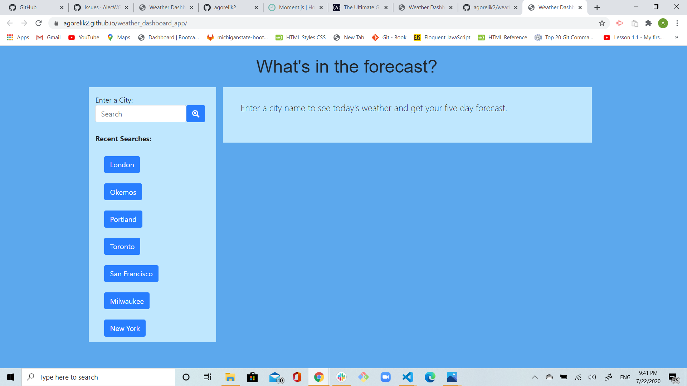
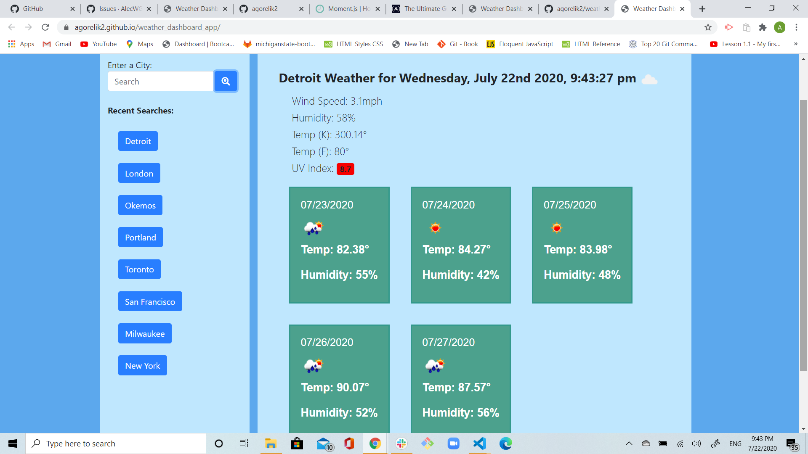
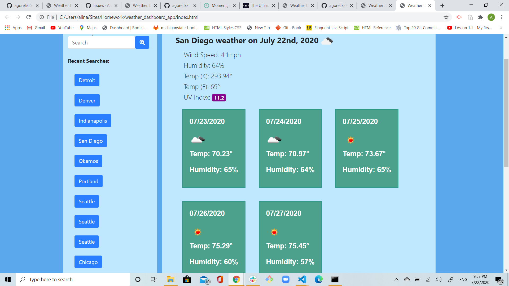

# weather_dashboard_app
# 06 Server-Side APIs: Weather Dashboard

## Description

This is a weather dashboard application that will run in the browser and feature dynamically updated HTML and CSS.
The purpose of the app is to show user today's weather and 5 day future forecast for a city that he/she searches. Data included in the forecast is windspeed, humidity, temp in Fahrenheit, and UV index level with badge indicating safety level.

Built with: HTML, CSS, JS, Bootstrap, OpenWeather Api's for weather data, moment js for date information and Google fonts api. Weather symbol pulled in from openweather api. Link to openweather api and documentation: https://openweathermap.org/api

This appliction was built with a combination of bootstrap framework and dynamically created javascript elements. The navbar, search field, search button and jumbotron were created with Bootstrap.
The weather display and 5 day forecast cards are dynamically created using Javascript. 
The search field captures the city name entered and retrieves the weather for that city with two seperate ajax calls to the openweather api. 
The weather icon is retrieved with an ajax call to the openweather api. 
After user searched on the city, the name of the city will be stored in local storage in the array format. It will be also displayed on the top of the search history as a button with the name of the city.
Cities searched will display in button form in a list on the left side of the application. 
When each city button is clicked, the application will display weather results for that city. The results will 

## API Usage
https://openweathermap.org/api


## URLs

The URL of the GitHub repository:
https://github.com/agorelik2/weather_dashboard_app

The URL of the deployed application:
https://agorelik2.github.io/weather_dashboard_app/


## Pictures of Weather Dashboard






## Usage

```
GIVEN a weather dashboard with form inputs.
WHEN user searches for a city,
THEN he is presented with current and future conditions for that city and that city is added to the search history.
WHEN user views current weather conditions for that city,
THEN he is presented with the city name, the date, an icon representation of weather conditions, the temperature, the humidity, the wind speed, and the UV index.
WHEN user looks at the UV index,
THEN he is presented with a color that indicates whether the conditions are favorable, moderate, or severe.
User is presented with a future weather conditions for that city
It is a 5-day forecast that displays the date, an icon representation of weather conditions, the temperature, and the humidity.
WHEN user clicks on a city in the search history,
THEN he is again presented with current and future conditions for that city.
WHEN user opens the weather dashboard,
THEN he is presented with the last searched city forecast.

## Plans for future development
Add a clear search list button to clear local storage to clear city search buttons list.

Pull in a picture of the city searched and display in the jumbotron with the weather. You could use a photo api to pull in and display the page.


